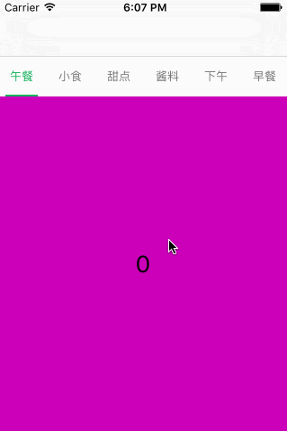

# LCTitleView


常用的标题视图，支持UIPageViewController，请参考 Demo
##Demo



##Installation

Cocoapods:
```
pod 'LCTitleView'
```
##Example Usage
```
#import <LCTitleView.h>
```
```
self.titleArray = @[@"午餐", @"小食", @"甜点", @"酱料", @"下午",@"早餐"];
self.titleView.titleArray = _titleArray;
self.titleView.buttonNormalColor = [UIColor colorWithRed:119.0f/255.0f green:119.0f/255.0f blue:119.0f/255.0f alpha:1.0f];
self.titleView.buttonSelectedColor = [UIColor colorWithRed:33.0f/255.0f green:175.0f/255.0f blue:94.0f/255.0f alpha:1.0f];
self.titleView.buttonFont = [UIFont systemFontOfSize:13.0f];
//  self.titleView.buttonInsets = 10.0f;
self.titleView.margin = 10.0f;
self.titleView.showSelectionBar = YES;
self.titleView.delegate = self;
self.titleView.targetScrollView = _collectionView;
```

##License

[MIT](http://mit-license.org/)
